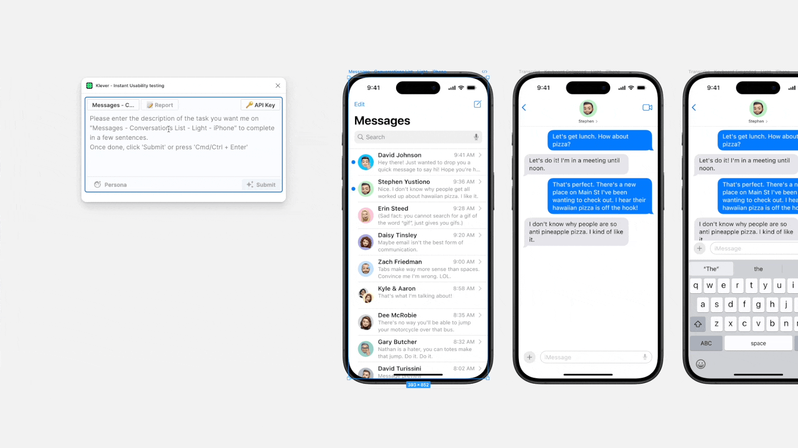

# Klever

  

## A clever analyzing tool for UI powered by AI

Get an instant usability testing report of your design with the AI AppAgent. Inspired by [AppAgent: Multimodal Agents as Smartphone Users](https://appagent-official.github.io/), Klever is a Figma plugin project designed to empower designers and developers by providing AI-driven insights into their UI designs.

### Features

- **GPT-4o Powered Multimodal Agents**: Utilize advanced AI to understand both screenshots and text descriptions, simulating real-world user interactions with your UI.
- **Instant Usability Reports**: Receive comprehensive usability testing reports within seconds, highlighting potential usability issues and offering actionable recommendations.
- **Persona Simulation**: Experiment with different user personas to see how various users might experience your design.
- **Seamless Figma Integration**: Analyze your designs directly within Figma, streamlining your workflow.

### Pricing

- **3-Day Free Trial**: Explore all of Klever's features with a 3-day free trial.
- **Subscription Model (Coming Soon)**: Continue accessing Klever's features with our monthly subscription model after the trial period.

### How to Use Klever

1. Open the design file you want to analyze in Figma.
2. Navigate to Plugins > Klever and open the plugin.
3. Select the frame or component you want to analyze.
4. (Optional) Create a Task for the AI to perform and set up different personas.
5. Click "Submit" or press "Cmd/Ctrl + Enter" to receive your AI-powered usability testing report.

## For Developers

### Quickstart

- Install dependencies with `yarn`.
- Start webpack in watch mode with `yarn build:watch`.
- Import the plugin into Figma by navigating to `Plugins` -> `Development` -> `Import plugin from manifest...` and selecting the `manifest.json` file from this repo.

### Toolings

This project uses:

- React + Webpack for the UI.
- TypeScript for type safety.
- Prettier for code formatting.
- Figma plugin API for interacting with Figma.

### Contributing

We aim to improve Klever by enhancing the AppAgent Figma prototype. If you're interested in contributing, please visit our repository and follow the guidelines:

- [Contribute to AppAgent](https://github.com/dusskapark/AppAgent)

Your contributions can significantly impact designers and developers worldwide.

### Acknowledgments

This project was inspired by Tencent's research on [AppAgent: Multimodal Agents as Smartphone Users](https://appagent-official.github.io/). We are grateful for their groundbreaking work in AI and usability testing.
